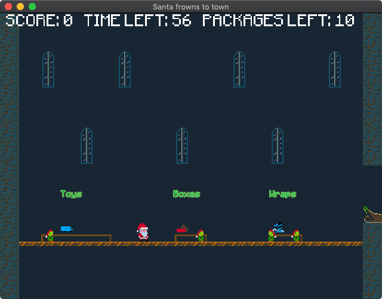
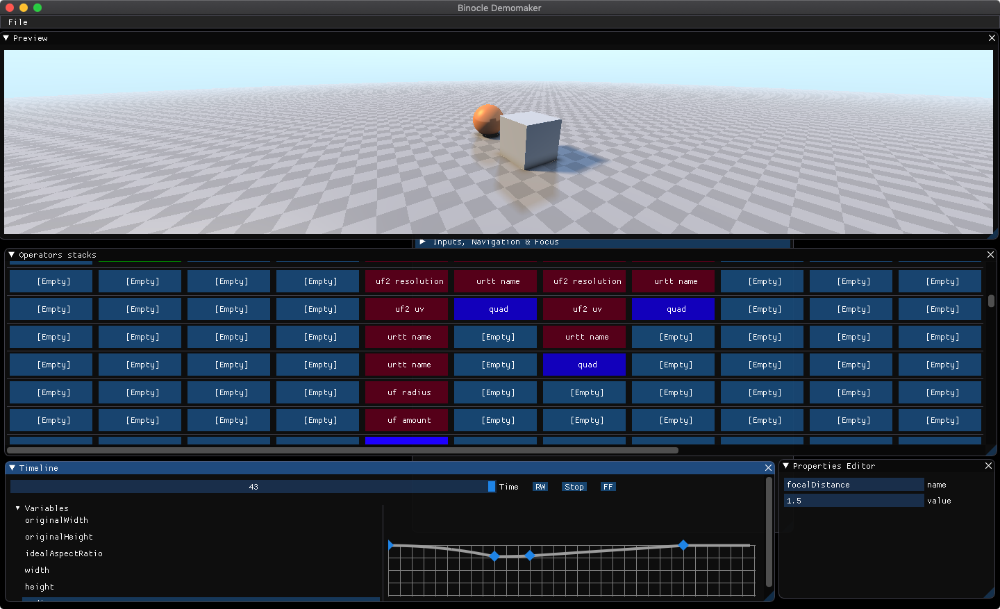

# Binocle C version


Binocle C version is a simple game engine written in pure C.

The previous incarnation was a C++ engine with way more features than this one, but I wanted to get back to the basics and trim everything down to a more manageable framework without all the bloat that C++ carries around.

It's born out of the need for the following features:

- Cross-platform compilation (macOS, Windows, iOS, Android, Web)
- OpenGL ES 2 support (but you can use any variant of OpenGL as long as it's supported by your hardware)

Nothing too fancy, but still something I always need when I make 2D or 3D games and prototypes.

The API is evolving all the time but the core is pretty stable. I keep adding and tweaking stuff based on my needs, so things may change without notice.

## Features

- Cross-platform: macOS, Windows, iOS, Android, Web (Linux planned)
- OpenGL API (ES 2/3 on mobile platforms) on all platforms
- Metal API available on iOS and macOS
- 2D Sprites
- Spritesheets (TexturePacker format. LibGDX format is in the works)
- Sprite batching
- Music and sound effects
- Bezier paths that can be used for anything
- BitmapFont fonts
- 2D Camera
- 2D Collisions (boxes and circles)
- Easing functions
- Entity Component System
- Timing functions
- Viewport adapters for 2D pixel perfect images
- Experimental hot code reloading for game code
- Lua scripting through LuaJIT on supported platforms and fallback to Lua where LuaJIT is not available
- Initial Wren scripting support
- 3D physics through Newton Dynamics (desktop platforms only)

## Documentation

The full documentation is available on [Read the Docs](http://binocle-c.readthedocs.io/)
Please notice that the documentation is still a work in progress.

## Installing

The easiest way to work with Binocle is to use the CLI project manager called `bone`.
With `bone` you can initialize a new project and automate the compilation and linking scripts. It's a quite young tool so please remember to make regular backups of your projects.

### Installing `bone`

You can grab `bone` from the [GitHub repo](https://github.com/tanis2000/bone).
You can either download the binaries on the [Releases](https://github.com/tanis2000/bone/releases) page or compile it yourself.

### Creating, building, running, updating and upgrading a project

Please refer to the [documentation of bone](https://github.com/tanis2000/bone/blob/master/README.md) to setup your first Binocle application.

## Third party libraries

Binocle sits on the shoulders of giants. I tried to keep the amount of external libraries to a minimum.
The current libraries are the following:

- SDL by the almighty Ryan C. Gordon (OS abstraction)
- miniaudio (cross-platform audio support)
- zlib
- Vorbis by the Xiph.Org Foundation
- OGG by the Xiph.Org Foundation
- [FreeType](http://www.freetype.org)
- Dear ImGui
- glew (for Windows OpenGL support)
- Kazmath by Luke Benstead
- stbimage
- parson
- LuaJIT
- sokol_time
- Lua
- libuv (Wren's dependency)
- Wren
- Newton Dynamics

## Coordinate system

Binocle uses a right-handed coordinate system which is the same used by OpenGL

## Contributing

You're welcome to try Binocle and contribute.

Right now there are a few areas that could use some help:

- Adding Linux support. It should work almost out of the box once you figure out the CMake scripts.
- More examples
- Travis scripts to build static libraries for all the different systems so that we can distribute Binocle as a binary library with just the headers and avoid having to recompile the whole library for every new project.
- Complete the Lua bindings
- Complete the Wren bindings

## Manually compiling the library

If you want to work on the library itself, just clone this repository and compile it on your own. The following are the build commands for each supported platform.

### macOS

```sh
mkdir build
cd build
cmake -G Xcode -D DEBUG=1 -D BUILD_EXAMPLE=1 ../
open binocle.xcodeproj
```

### Windows

I usually run the CMake GUI tool and select the Visual Studio generator there. That's pretty much all that's needed.

### Android

You will need the Android SDK and NDK and the correct environment variables for this to work.

```sh
mkdir build
cd build
cmake -D DEBUG=1 -D BUILD_EXAMPLE=1 -D ANDROID_ABI=armeabi-v7a -D ANDROID_STL=c++_static -D ANDROID_PLATFORM=android-21 -D CMAKE_TOOLCHAIN_FILE=../cmake/android.toolchain.cmake ../
make -j8
cmake -D DEBUG=1 -D BUILD_EXAMPLE=1 -D ANDROID_ABI=arm64-v8a -D ANDROID_STL=c++_static -D ANDROID_PLATFORM=android-21 -D CMAKE_TOOLCHAIN_FILE=../cmake/android.toolchain.cmake ../
make -j8
cmake -D DEBUG=1 -D BUILD_EXAMPLE=1 -D ANDROID_ABI=x86 -D ANDROID_STL=c++_static -D ANDROID_PLATFORM=android-21 -D CMAKE_TOOLCHAIN_FILE=../cmake/android.toolchain.cmake ../
make -j8
cmake -D DEBUG=1 -D BUILD_EXAMPLE=1 -D ANDROID_ABI=x86_64 -D ANDROID_STL=c++_static -D ANDROID_PLATFORM=android-21 -D CMAKE_TOOLCHAIN_FILE=../cmake/android.toolchain.cmake ../
make -j8
cd ../platform/android/android-project
./gradlew installDebug
```

### iOS

You will need the latest Xcode and its command line tools.

```sh
mkdir build
cd build
cmake -G Xcode -D DEBUG=1 -D IOS=1 -D BUILD_EXAMPLE=1 ../
open binocle.xcodeproj
```

### Emscripten (web)

You need a recent version of Emscripten installed on your system.
If you're using macOS, you can't just do a `brew install emscripten` to set it up. It will have issues.
The best way is to clone emscripten's repository and follow its setup guide.
In the end you will have a shell script to run to setup all the environment variables. Just replace its path in the script below.

```sh
mkdir build
cd build
source "/Users/tanis/Documents/emsdk/emsdk_env.sh"
emcmake cmake ../ -DCMAKE_BUILD_TYPE=Release -D BUILD_EXAMPLE=1
make -j8
cd example/src
python -m SimpleHTTPServer 8000
open http://localhost:8000/ExampleProject.html
```

### Generating the documentation

To generate the documentation just add the `-DBUILD_DOC=ON` option when running cmake.

## Credits

Many of the concepts come from Matt Thorson's Monocle engine (the name of this project is a kind of joke around Matt's engine name as you can guess).

Some code has been developed while Prime31 was working on its own C# engine called Nez so there will surely be similarities and lines of code that are almost the same.

The ECS has been inspired by [Artemis](https://github.com/junkdog/artemis-odb) and some parts have been taken from [Diana](https://github.com/discoloda/Diana)
Other pieces of code have been taken here and there on the web and I can't recall where they come from. If you see some code that looks familiar, please let me know and I'll give full credits.

The Metal backend and the glue code to keep both OpenGL and Metal as available backends has been taken from Andre Weissflog's exceptional Sokol library. I started implementing a first version based on it and I ended up reusing a lot of his code. In the future I will probably just adopt Sokol as the backend, but it was actually a good exercise to learn how to implement a cross-platform API with complete separation of platform-dependent code.

The logo has been created using the following images:

- [GamePad](https://www.flaticon.com/free-icon/game-console_434898) by [Freepik](https://www.freepik.com/)
- [binoculars](https://www.flaticon.com/free-icon/binoculars_125767) by [Gregor Cresnar](https://www.flaticon.com/authors/gregor-cresnar)

The idea of the final logo is from [@h_a_l_e_x](https://twitter.com/h_a_l_e_x)

## Examples

Here's an [examples' repository](https://github.com/tanis2000/binocle-c-examples) with a few examples to start with.

This repository also contains an example project that I use to debug and test new features.
It can be compiled by using the `-D BUILD_EXAMPLE=1` CMake directive.

## Projects using Binocle


[Santa frowns to town](https://tanis.itch.io/santa-frowns-to-town), my entry for Ludum Dare 43.
You can get the [source code here](https://github.com/tanis2000/ld43-binocle)


Binocle Demo Tool, my personal unreleased demo tool

## License

The MIT License (MIT)
Copyright (c) 2015-2019 Valerio Santinelli

Permission is hereby granted, free of charge, to any person obtaining a copy of this software and associated documentation files (the "Software"), to deal in the Software without restriction, including without limitation the rights to use, copy, modify, merge, publish, distribute, sublicense, and/or sell copies of the Software, and to permit persons to whom the Software is furnished to do so, subject to the following conditions:

The above copyright notice and this permission notice shall be included in all copies or substantial portions of the Software.

THE SOFTWARE IS PROVIDED "AS IS", WITHOUT WARRANTY OF ANY KIND, EXPRESS OR IMPLIED, INCLUDING BUT NOT LIMITED TO THE WARRANTIES OF MERCHANTABILITY, FITNESS FOR A PARTICULAR PURPOSE AND NONINFRINGEMENT. IN NO EVENT SHALL THE AUTHORS OR COPYRIGHT HOLDERS BE LIABLE FOR ANY CLAIM, DAMAGES OR OTHER LIABILITY, WHETHER IN AN ACTION OF CONTRACT, TORT OR OTHERWISE, ARISING FROM, OUT OF OR IN CONNECTION WITH THE SOFTWARE OR THE USE OR OTHER DEALINGS IN THE SOFTWARE.
